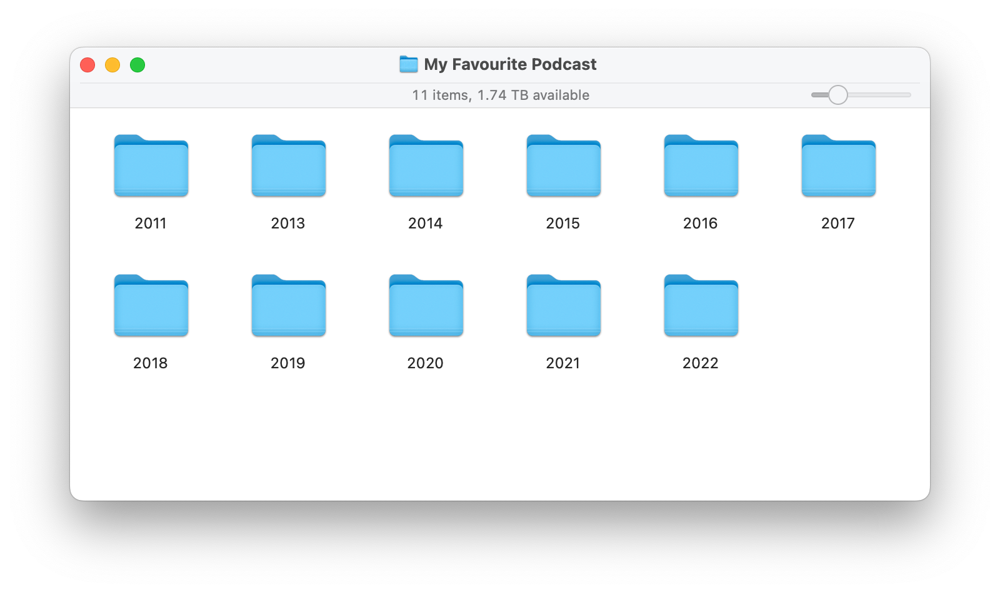

# Podcast Archive
A tool for downloading all episodes of a particular podcast.

## Features
1. Downloads episodes in a neat Show name > year > month directory format format.
2. Will automatically skip files that have already been downloaded (unless they've since been updated)
3. Ability to specify a date range, if you only want to download some episodes. 
4. Downloaded files will have the creation date filesystem attribute set to match the episode's original public date and time.

` -u, --url      Required. The URL of the podcast RSS feed. (Required)

  -s, --start    Start date. yyyy-MM-dd Only download episodes on or after this
                 date.

  -e, --end      End date. yyyy-MM-dd Only download episodes on or before this
                 date.

  --help         Display this help screen.
`

