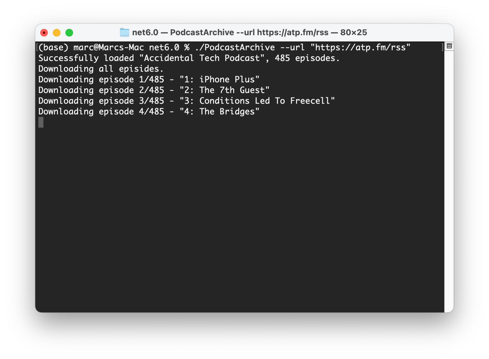
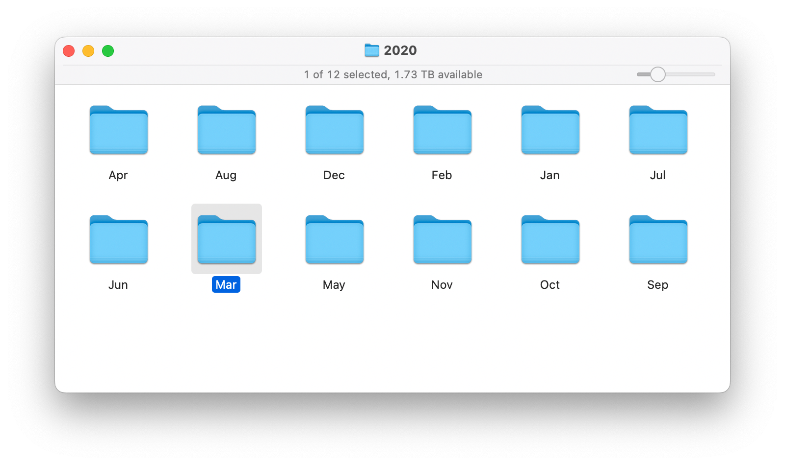

# Podcast Archive
A tool for downloading all episodes of a particular podcast.

## Features
1. Downloads episodes in a neat `Show name` > `year` > `month` directory format format.
2. Will automatically skip files that have already been downloaded (unless they've since been updated)
3. Ability to specify a date range, if you only want to download some episodes. 
4. Downloaded files will have the creation date filesystem attribute set to match the episode's original publish date and time.

 -u, --url      Required. The URL of the podcast RSS feed. (Required)

 -s, --start    Start date. yyyy-MM-dd Only download episodes on or after this
                 date.

-e, --end      End date. yyyy-MM-dd Only download episodes on or before this
                 date.

## Download instructions
Either build from source using .NET 6, or download one of the prebuilt applications in the `Downloads` directory.  On Mac and Linux, you'll need to first make the file executable by running the command `chmod u+x PodcastArchive`. You can then run the application by typing `./PodcastArchive` followed the commands above.

### Example usage
Download all episodes
`./PodcastArchive --url "https://geeknewscentral.com/podcast.xml"`

Download all episodes in March 2020
`./PodcastArchive -u "https://feeds.acast.com/public/shows/61850ae845b6e300132557e2" -s 2020-03-01 -e 2020-03-31`

Download all episodes since 20th May 2022
`./PodcastArchive --url "https://geeknewscentral.com/podcast.xml" --start 2022-05-20`

Download all episodes before 1st December 2012
`./PodcastArchive --url "https://podcasts.files.bbci.co.uk/b00lvdrj.rss" --end 2012-12-01`